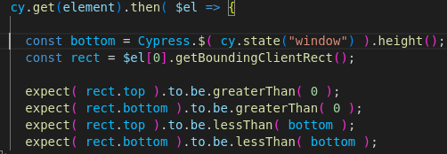
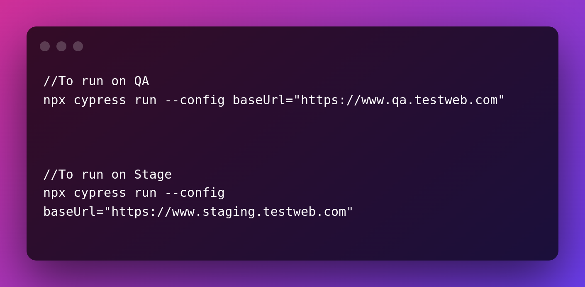

<!-- Output copied to clipboard! -->

<!-- You have some errors, warnings, or alerts. If you are using reckless mode, turn it off to see inline alerts.
* ERRORs: 0
* WARNINGs: 0
* ALERTS: 18 -->
<p>
<strong>Cypress problems we are trying to solve(Tips and  Hacks)</strong>
</p>
<p>
<strong>Problems : </strong>
</p>
<table>
  <tr>
   <td>
   </td>
   <td><strong>Problem statement</strong>
   </td>
   <td><strong>Status</strong>
   </td>
   <td><strong>Person to contact</strong>
   </td>
   <td><strong>Test Trove Integration </strong>
   </td>
  </tr>
  <tr>
   <td>1
   </td>
   <td>Readable Output in CI CD
   </td>
   <td><strong>Solved</strong>
   </td>
   <td><strong>Mudit</strong>
   </td>
   <td><strong>Done</strong>
   </td>
  </tr>
  <tr>
   <td>2
   </td>
   <td>Reporting
   </td>
   <td><strong>Solved</strong>
   </td>
   <td><strong>Mudit</strong>
   </td>
   <td>
   </td>
  </tr>
  <tr>
   <td>3
   </td>
   <td>Emailing with Gitlab( Sending Summary of Report and Report Link via
Gitlab)
   </td>
   <td><strong>Solved</strong>
   </td>
   <td><strong>Mudit</strong>
   </td>
   <td><strong>Done</strong>
   </td>
  </tr>
  <tr>
   <td>4
   </td>
   <td>Parallelization  with Dashboard
   </td>
   <td><strong>Completed</strong>
   </td>
   <td><strong>Mudit</strong>
   </td>
   <td>
   </td>
  </tr>
  <tr>
   <td>5
   </td>
   <td>Iframe issue
   </td>
   <td><strong>Solved</strong>
   </td>
   <td><strong>Sharmila , Shreya A</strong>
   </td>
   <td>
   </td>
  </tr>
  <tr>
   <td>6
   </td>
   <td>Element not clickable
   </td>
   <td><strong>Solved</strong>
   </td>
   <td><strong>Mudit</strong>
   </td>
   <td><strong>Done</strong>
   </td>
  </tr>
  <tr>
   <td>7
   </td>
   <td>Avoiding repetition of code
   </td>
   <td><strong>Solved</strong>
   </td>
   <td><strong>Mudit</strong>
   </td>
   <td><strong>Done</strong>
   </td>
  </tr>
  <tr>
   <td>8
   </td>
   <td>Mouse Hover
   </td>
   <td>
   </td>
   <td>
   </td>
   <td>
   </td>
  </tr>
  <tr>
   <td>9
   </td>
   <td>Multiple Window Handling (Work around way)
   </td>
   <td><strong>Solved</strong>
   </td>
   <td><strong>Mudit</strong>
   </td>
   <td>
   </td>
  </tr>
  <tr>
   <td>10
   </td>
   <td>Enabling intellisense support for IDE(Helps in Fast coding, no need to
memorize/google the inbuilt function)
   </td>
   <td><strong>Solved</strong>
   </td>
   <td><strong>Mudit</strong>
   </td>
   <td><strong>Done</strong>
   </td>
  </tr>
  <tr>
   <td>11
   </td>
   <td>Enabling intellisense support for cypress-xpath plugin in the IDE
   </td>
   <td><strong>Solved</strong>
   </td>
   <td><strong>Mudit</strong>
   </td>
   <td><strong>Done</strong>
   </td>
  </tr>
  <tr>
   <td>12
   </td>
   <td>Using variables/aliases across different tests in same test file
   </td>
   <td><strong>Solved</strong>
   </td>
   <td><strong>Mudit</strong>
   </td>
   <td>
   </td>
  </tr>
  <tr>
   <td>13
   </td>
   <td>Changing the size of Automated cypress browser window(using viewport)
   </td>
   <td><strong>Solved</strong>
   </td>
   <td><strong>Mudit, Sharmila</strong>
   </td>
   <td><strong>Done</strong>
   </td>
  </tr>
  <tr>
   <td>14
   </td>
   <td>Percy Integration
   </td>
   <td><strong>Percy integration done but percy integration with shadow dom
remaining</strong>
<p>
<strong><a
href="https://github.com/percy/cli/issues/280">https://github.com/percy/cli/issues/280</a></strong>
   </td>
   <td>
   </td>
   <td>
   </td>
  </tr>
  <tr>
   <td>15
   </td>
   <td>Clipboard API Validation
   </td>
   <td><strong>WIP</strong>
   </td>
   <td><strong>Mudit, Sharmila</strong>
   </td>
   <td>
   </td>
  </tr>
  <tr>
   <td>16
   </td>
   <td>Parallelization <strong>without</strong> using Cypress Dashboard
   </td>
   <td><strong>Solved</strong>
   </td>
   <td><strong>Veer</strong>
   </td>
   <td><strong>Done</strong>
   </td>
  </tr>
  <tr>
   <td>17
   </td>
   <td>Execute cypress test on different environment
   </td>
   <td><strong>Solved</strong>
   </td>
   <td><strong>Veer</strong>
   </td>
   <td>
   </td>
  </tr>
  <tr>
   <td>18
   </td>
   <td>Hide unwanted XHR Logs from cypress run while execution
   </td>
   <td><strong>Solve</strong>
   </td>
   <td><strong>Veer</strong>
   </td>
   <td><strong>Done</strong>
   </td>
  </tr>
  <tr>
   <td>19
   </td>
   <td>Hide Password/any text from being visible in the cypress test runner
steps
   </td>
   <td><strong>Solved</strong>
   </td>
   <td><strong>Mudit</strong>
   </td>
   <td><strong>Done</strong>
   </td>
  </tr>
  <tr>
   <td>20
   </td>
   <td>Cypress Custom Commands for repeated methods
   </td>
   <td><strong>Solved</strong>
   </td>
   <td><strong>Mudit</strong>
   </td>
   <td><strong>Done</strong>
   </td>
  </tr>
  <tr>
   <td>21
   </td>
   <td>Enable Caching for cypress dependencies in gitlab
   </td>
   <td><strong>Solved</strong>
   </td>
   <td><strong>Mudit</strong>
   </td>
   <td><strong>Done</strong>
   </td>
  </tr>
  <tr>
   <td>22
   </td>
   <td>Cypress Sticky Page Item - validation on scroll
   </td>
   <td><strong>Solved</strong>
   </td>
   <td><strong>Suriya</strong>
   </td>
   <td>
   </td>
  </tr>
  <tr>
   <td>23
   </td>
   <td>Cypress view page source - Fallback scenarios
   </td>
   <td><strong>Solved</strong>
   </td>
   <td><strong>Suriya /Shreya A</strong>
   </td>
   <td>
   </td>
  </tr>
  <tr>
   <td>24
   </td>
   <td>Checking 404 status code
   </td>
   <td><strong>Solved</strong>
   </td>
   <td><strong>Shreya A</strong>
   </td>
   <td>
   </td>
  </tr>
  <tr>
   <td>25
   </td>
   <td>Gitlab Downloading npm dependencies only once
   </td>
   <td><strong>Solved</strong>
   </td>
   <td><strong>Mudit</strong>
   </td>
   <td><strong>Done</strong>
   </td>
  </tr>
  <tr>
   <td>26
   </td>
   <td>Cypress Parallel script to Plugin Development (Open sourcing the script,
making it accessible to be used as npm package install)
   </td>
   <td><strong>To Do</strong>
   </td>
   <td><strong>Veer,Mudit</strong>
   </td>
   <td>
   </td>
  </tr>
  <tr>
   <td>27
   </td>
   <td>Limiting Test Report mail to be sent only on cron schedule
   </td>
   <td><strong>Solved</strong>
   </td>
   <td><strong>Mudit</strong>
   </td>
   <td><strong>Solved</strong>
   </td>
  </tr>
  <tr>
   <td>28
   </td>
   <td>Enabling videos and screenshots in cypress mochawesome report
   </td>
   <td><strong>Solved</strong>
   </td>
   <td><strong>Mudit</strong>
   </td>
   <td>
   </td>
  </tr>
  <tr>
   <td>29
   </td>
   <td>Print cypress logs to command line
   </td>
   <td><strong>Solved</strong>
   </td>
   <td><strong>Suriya</strong>
   </td>
   <td>
   </td>
  </tr>
  <tr>
   <td>30
   </td>
   <td>Type special characters in the input field
   </td>
   <td><strong>Solved</strong>
   </td>
   <td><strong>Mudit</strong>
   </td>
   <td>
   </td>
  </tr>
  <tr>
   <td>31
   </td>
   <td>Setting multiple environment variables with single command(bash script to
refer)
   </td>
   <td><strong>Solved</strong>
   </td>
   <td><strong>Mudit</strong>
   </td>
   <td><strong>Done</strong>
   </td>
  </tr>
  <tr>
   <td>32
   </td>
   <td>Cross Browser Testing using Cypress(Safari/Chrome/Firefox)
   </td>
   <td><strong>Solved </strong>
   </td>
   <td><strong>Shashank </strong>
   </td>
   <td>
   </td>
  </tr>
  <tr>
   <td>33
   </td>
   <td>Cypress Xpath Plugin enablement
   </td>
   <td><strong>Solved</strong>
   </td>
   <td><strong>Mudit</strong>
   </td>
   <td><strong>Done</strong>
   </td>
  </tr>
</table>
<p>
</p>
<hr>
<p>
<strong>Problem :  Readable output in CI CD :</strong>
</p>
<p>
Solution :  Add ```NO_COLOR=1``` in jenkins command
</p>
<p>

</p>
<hr>
<p>
<strong>Problem : Sometimes the element cannot be clicked,typed or any other
action, due to an overlapping element</strong>
</p>
<p>
	Solution: use {force:true} in the action to be performed
</p>
<hr>
<p>
<strong>Problem: Avoiding repetition of code which is to be carried on all tests
files, (For example logging into the site)</strong>
</p>
<p>
	Solution: Use Cypress Custom Commands and define the functionality in
cypress/commands.js file
</p>
<hr>
<p>
<strong>Problem: Handling multiple windows in cypress ( We know that this
feature is not yet officially supported by cypress)(Works only if the the link
is having a target attribute for opening a new window )</strong>
</p>
<p>
<strong>	Workaround:</strong>
</p>
<p>
Use <strong><code>.invoke( 'removeAttr', 'target' ) to prevent the link to be
opened in a new tab/window and then you can carry out the test in usual
way</code></strong>


<pre
class="prettyprint">Example:
cy.xpath( 'locator' ).should( 'be.visible' ).invoke( 'removeAttr', 'target' ).click( { force: true } );

<hr></pre>
<p>
<strong>Problem: Turning on the intellisense feature on visual studio code so
that autosuggestions comes for cypress</strong>
</p>
<p>
Solution: Use /// <reference types="Cypress" /> in the start of the testcase
file
</p>
<hr>
<p>
<strong>Problem: Using XPath in Cypress (Cypress out of the box do not support
xpath based locators)</strong>
</p>
<p>
Solution : npm i cypress-xpath — save-dev
</p>
<p>
Above command shall add the dependency of cypress-xpath to package.json
</p>
<p>
In cypress/support/index.js add
</p>
<p>
require(‘cypress-xpath’)
</p>
<hr>
<p>
<strong>Problem: Enable intellisense support for cypress-xpath plugin</strong>
</p>
<p>
Solution: /// <reference types="cypress-xpath" />
</p>
<hr>
<p>
<strong>Problem: Percy integration</strong>
</p>
<p>
<strong>Solution: <code> </code>npm install --save-dev @percy/cli
@percy/cypress</strong>

<p>
<strong>Add below to the cypress/support/index.js</strong>
</p>
<p>
<strong>import '@percy/cypress';</strong>
</p>
<p>
<strong>In the terminal</strong>
</p>
<p>
<strong>export PERCY_TOKEN=<your token here></strong>
</p>
<p>
<strong>Inside the test , add</strong>
</p>
<p>
<strong>cy.percySnapshot();</strong>
</p>
<p>
<strong>Run your cypress tests with Percy:</strong>
</p>
<p>
<strong>For running all test files -</strong>
</p>
<p>
<strong>npx percy exec – cypress run </strong>
</p>
<p>
<strong>For running selected test files</strong>
</p>
<p>
<strong>npx percy exec – cypress run –spec=<comma separated test file relative
paths></strong>
</p>
<hr>
<p>
<strong>Problem: Using Common variables/alias to be shared across different
tests in the same file</strong>
</p>
<p>
Solution:  Alias defined using .as(var_name) can be reused in some different
test
</p>
<p>
In the following way:
</p>
<p>
<strong>Example:</strong>
</p>


<pre
class="prettyprint">it('Get project title', () => {
       cy.get('locator').invoke('val').as('projName')
       cy.wait(5000)
       })

    it('Use projName variable', function() {
       cy.get('locator').type(this.projName, { force: true });})

<hr></pre>
<p>
<strong>Problem: Handling Iframes</strong>
</p>
<p>
<strong>Solution:</strong>
</p>
<p>
Method 1: [can be used when Iframe is used across multiple files)
</p>
<ol>
<li>Add the below in the command.js file
</li>
</ol>
<p>

</p>
<ol>
<li>Use getIframeBody in your test file to Perform any validation and actions
inside the Iframe as type() or click()


<pre
class="prettyprint">cy.getIframeBody("iframe_element").find("..").should('be.visible').type()

</li>
</ol></pre>
<p>
Method 2: Use Iframe directly into your test case and Perform any validation and
actions inside the Iframe as type() or click() as below. Xpath can also be used
for Iframe element.
</p>
<p>

</p>
<ol>
<li>Add “ ‘import cypress-iframe’; “ inside support/index.js and then try below
code in your test file
</li>
</ol>
<p>
	<strong>cy.frameLoaded(Iframe_attribute)</strong>
</p>
<p>
<strong>
cy.iframe(iframe_attribute).find(iframe_element_to_search).click()</strong>
</p>
<hr>
<p>
<strong>Problem: Testing with  different  sizes of the Browser window
(Simulating multiple screen sizes)</strong>
</p>
<p>
<strong>Solution: </strong>Cypress sets the browser size of width to 1000px and
the height to 660px by default. cy.viewport(width, height) helps to set the
browser in different screen size.
</p>
<ol>
<li>Add the below command in beforeEach Block in the test file.
</li>
</ol>


<pre
class="prettyprint">cy.viewport( Cypress.env('width'), Cypress.env('height') )
</pre>
<ol>
<li>In cypress.json file add the height and width for view
port.


<pre
class="prettyprint"> "env": {
   "width": 1280,
   "height": 720
 }

</li>
</ol></pre>
<p>
Note: 1280x720 is the size of the automated browser in selenium.
</p>
<hr>
<p>
<strong>Problem : Mailing with Gitlab</strong>
</p>
<p>
<strong>Gitlab does not have a preconfiguration which can be used to trigger
email reports as Jenkins Have. We can use the following python script to send
mail containing a summary of reports in the mail body  and  cypress report
link.</strong>
</p>


<pre
class="prettyprint">import json
import smtplib
import requests
f=open('./e2e/reports/index.json')
testdata=json.load(f)
print(testdata['stats'])
total_tests=testdata['stats']['tests']
total_failing=testdata['stats']['failures']
total_pass=testdata['stats']['passes']
total_skipped=testdata['stats']['skipped']
percentpass=round((int(total_pass)/int(total_tests))*100)
emails=['&lt;receiver emails>']
smtp_server = "smtp.corp.redhat.com"
port = 25
smtpAuth = "none"
sender_email = "&lt;sender mail>"
receiver_email =emails
message = """\
MIME-Version: 1.0
Content-type: text/html
Subject: One Platform Test Result(UI Pass Percentage:{percentpass})
From:{sender_mail}
To: {to_mail}

&lt;h3>&lt;i>Testing is completed. The Reports Are Ready:&lt;/i>&lt;/h3>

&lt;h5>Summary of Cypress Test Report:&lt;/h5>
&lt;table style="border-top: 1px solid #dee2e6;
 border-collapse: collapse;
 color: #434343;
 font-family: 'Red Hat Text';
 margin-left: 1rem;
 font-size: 16px;">
 &lt;thead style="border-bottom: 2px solid #dee2e6;">
   &lt;tr style="border-top: 1px solid #dee2e6;">
     &lt;th style="padding: 1rem;
 padding-left: 0.5rem;
 text-align: left;">
       Test Metrics
     &lt;/th>
     &lt;th style="padding: 1rem;
 padding-left: 0.5rem;
 text-align: left;">Count&lt;/th>
   &lt;/tr>
 &lt;/thead>
 &lt;tbody>
   &lt;tr style="border-top: 1px solid #dee2e6; border-left: 3px solid #007bff;">
     &lt;td style="padding: 1.5rem;
 padding-left: 0.25rem">
       Total Tests
     &lt;/td>
     &lt;td style="padding: 1.5rem;
 padding-left: 0.25rem">
       {total_tests}
     &lt;/td>
   &lt;/tr>
   &lt;tr style="border-top: 1px solid #dee2e6; border-left: 3px solid red;">
     &lt;td style="padding: 1.5rem;
 padding-left: 0.25rem">
       Total Failed Tests
     &lt;/td>
     &lt;td style="padding: 1.5rem;
 padding-left: 0.25rem">
       {total_failing}
     &lt;/td>
   &lt;/tr>
   &lt;tr style="border-top: 1px solid #dee2e6; border-left: 3px solid #28a745;">
     &lt;td style="padding: 1.5rem;
 padding-left: 0.25rem">
       Total Passing Tests
     &lt;/td>
     &lt;td style="padding: 1.5rem;
 padding-left: 0.25rem">
       {total_pass}
     &lt;/td>
   &lt;/tr>
   &lt;tr style="border-top: 1px solid #dee2e6; border-left: 3px solid yellow;">
     &lt;td style="padding: 1.5rem;
 padding-left: 0.25rem">
       Total Skipped Tests
     &lt;/td>
     &lt;td style="padding: 1.5rem;
 padding-left: 0.25rem">
       {total_skipped}
     &lt;/td>
   &lt;/tr>
 &lt;/tbody>
&lt;/table>

&lt;h4 style="color:gray">Report Link&lt;/h4>
&lt;gitlab pages url>
&lt;br>&lt;br>
Regards,&lt;br>
""".format(sender_mail=sender_email, to_mail=emails, total_tests=total_tests,total_failing=total_failing, total_pass=total_pass,percentpass=percentpass,total_skipped=total_skipped)

with smtplib.SMTP(smtp_server, port) as server:
   server.connect("smtp.corp.redhat.com",25)
   server.ehlo()  # Can be omitted
   server.set_debuglevel(1)
   server.sendmail(sender_email, emails, message)
</pre>
<p>
<strong>In gitlab-ci.yml</strong>
</p>
<p>
<strong>Define notify stage under stages and </strong>
</p>


<pre
class="prettyprint">notify:
 stage: notify
 needs:
   - test
   - pages
 dependencies:
   - test
   - pages
 image: python
 before_script:
   - pip3 install requests
 script:
   - ls e2e/reports
   - python3 sendmail.py
 tags:
   - shared

<hr></pre>
<p>
<strong>Parallelization without using Cypress Dashboard </strong>
</p>
<p>
<strong>Problem Statement: Executing cypress test in parallel without using the
cypress dashboard. </strong>
</p>
<p>
<strong>Solution: </strong>
</p>
<p>
<strong>In order to execute the cypress test in parallel following steps need to
be followed. The custom code needs to be written in order to achieve this.
</strong>
</p>
<ul>
<li><strong>In Gitlab-ci.yml we specify count for nodes to be used in parallel
execution. </strong>
<li><strong>Gitlab has variables that allow it to retrieve the number of nodes
and index of the node in order to identify the node on which tests need to be
executed. </strong>
<li><strong>CI_NODE_INDEX</strong>
<li><strong>CI_NODE_TOTAL </strong>
<li><strong>Once we identify the node the next step we have to perform is to get
the number spec files present in the Integration folder and divide those files
across the number nodes available. </strong>
<li><strong>Once that is done, the cypress run command executes the list of
files across the different nodes. </strong>
<li><strong>Sample Code for the same is as below. </strong>
<p>
    <p style="text-align: right">

</p>
</p>
</li>
</ul>
<p>
<strong>The above code will give the  comma separated list files which need to
be executed.</strong>
</p>
<p>
<strong>Once that step is done add a script that will execute your cypress test.
</strong>
</p>
<p>

</p>
<p>
<strong>In Gitlab.ci.yml below script is executed. </strong>
</p>
<p>

</p>
<p>
<strong>Kindly note that you can test the code only with the gitlab pipeline.
</strong>
</p>
<hr>
<p>
<strong>Execute Cypress Tests on Different environment</strong>
</p>
<p>
<strong>Problem Statement: Executing the same tests of different environments
like QA,Stage, Production. </strong>
</p>
<p>
<strong>The above can be achieved in different ways. </strong>
</p>
<p>
<strong>Method 1: </strong>
</p>
<p>
<strong>In cypress.json file we can add key for baseUrl as below</strong>
</p>
<p>

</p>
<p>
<strong>In the spec file use Cypress.config().baseUrl; command to access
baseUrl</strong>
</p>
<p>

</p>
<p>
<strong>Use the cypress command line to pass the baseURL dynamically. </strong>
</p>
<p>

</p>
<p>
<strong>Method 2</strong>
</p>
<p>
<strong>Creating different configuration file files for each environment
</strong>
</p>
<p>
<strong>Step 1: Create your own cypress configuration file in the Root Folder
</strong>
</p>
<p>
<strong> Example: staging-config.json, qa-config.json </strong>
</p>
<p>
<strong>Step 2:In custom/ow cypress config files add the baseUrl key as shown
below. </strong>
</p>
<p>
<strong>The first key is added in order to override the settings that are
present is cypress.json. In this case we are overriding the baseUrl. </strong>
</p>
<p>
<strong>This also inherits the properties that are already there cypress.json
file</strong>
</p>
<p>

</p>
<p>

</p>
<p>
<strong>Step 3: Use the Cypress.config().Baseurl command in your tests.
</strong>
</p>
<p>
<strong>Step 4: Run Cypress Tests on multiple environments.</strong>
</p>
<p>

</p>
<p>
<strong>The above commands can also be added to your package.json file </strong>
</p>
<hr>
<p>
<strong>HIDE XHR logs in Cypress Runner. </strong>
</p>
<p>
<strong>Cypress internally logs lots of calls which are not required. Due to
these logs actual verification we are trying to do get lost. We can control this
behavior with the help of custom code as below. </strong>
</p>
<p>
<strong>This code needs to be added in to index.js </strong>
</p>
<p>

</p>
<p>
<strong>This is configurable from cypress.json. In cypress.json we need to add
key name“hideXHR” </strong>
</p>
<p>
<strong>When Set is true it will hide the logs in cypress runner else if false
it will show all the logs in cypress runner</strong>
</p>
<p>
<strong>Problem: Not to show what password or any text is being typed into the
textbox/input field</strong>
</p>
<p>
<strong>Solution: Use {log:false} in the type() method</strong>
</p>
<p>
<strong>Example: </strong>
</p>


<pre
class="prettyprint">cy.get('#password').type(password,{log:false});
</pre>
<p>
<strong>Problem: To be able to use Cypress Custom Commands for using repeated
methods without writing a lot of code again and again</strong>
</p>
<p>
<strong>Solution</strong>
</p>


<pre
class="prettyprint">Cypress.Commands.add("login", (username, password) => {
   cy.get('#username', { timeout: 5000 }).type(username);
   cy.get('#password').type(password,{log:false});
   cy.get('#submit').click();
})
</pre>
<p>
<strong>Add above in commands.js</strong>
</p>
<p>
<strong>Use above method as given below:</strong>
</p>


<pre
class="prettyprint">  cy.login(Cypress.env('USERNAME'), Cypress.env('PASSWORD'))
</pre>
<p>
<strong>Problem: Enable caching for dependency installation in gitlab for
cypress thereby saving time in npm install</strong>
</p>
<p>
<strong>Solution: Add  below in each and every stage of pipeline which require
npm commands to be executed</strong>
</p>
<p>
<strong>  cache:</strong>
</p>
<p>
<strong>    paths:</strong>
</p>
<p>
<strong>      - .npm</strong>
</p>
<p>
<strong>      - cache/Cypress</strong>
</p>
<p>
<strong>____________________________________________________________________________</strong>
</p>
<p>
<strong>Problem: Cypress sticky page items validation - on scroll</strong>
</p>
<p>
<strong>There is no built-in built method / function in cypress which can
validate if an element comes to visibility on scroll.</strong>
</p>
<p>
<strong>Solution:  </strong>
</p>
<p>
Step1: Fetch the current window height
</p>
<p>
Step2 : Get the specific element size information using getBoundingClientRect
function.
</p>
<p>
Step3: Assert the element top & bottom with window height
</p>
<p>
Step4: Call the function to assert for visible/invisible elements on scroll.
</p>
<p>

</p>
<p>
<strong>____________________________________________________________________________</strong>
</p>
<p>
<strong>Problem: Cypress view page source </strong>
</p>
<p>
<strong>Solution: </strong>
</p>
<p>
I feel like selenium (getPageSource) there is no direct method to view the page
source of a web page in cypress. (mostly needed in case of validating fallback
behavior)
</p>
<p>
We identified that we can search for the element in DOM and write CSS for it
(for example meta tags in my case) and assert it with the expected page source
value for the tag. This will be helpful to validate the fallback behavior.
</p>
<p>

</p>
<hr>
<p>
<strong>Problem: Checking 404 status code </strong>
</p>
<p>
<strong>Solution: </strong>
</p>
<p>
<strong>	</strong>
</p>


<pre
class="prettyprint">       cy.request({url: "url" , failOnStatusCode: false }).then((resp)=>{
           if (resp.status == '404')
           {
               cy.log(url+ "Status is 404")
           }
       })
</pre>
<p>
<strong>Problem: Download the npm dependencies only once in the different stages
of pipeline created in gitlab</strong>
</p>
<p>
<strong>Solution: Implement caching of dependencies</strong>
</p>
<p>
<strong>Define below in each and every stage which requires npm package
downloading</strong>
</p>


<pre
class="prettyprint">cache:
   paths:
     - .npm
     - cache/Cypress
     - node_modules
</pre>
<p>
<strong>Define below variables at the top in the variables section</strong>
</p>
<p>
<strong>variables:</strong>
</p>


<pre
class="prettyprint">npm_config_cache: "$CI_PROJECT_DIR/.npm"
CYPRESS_CACHE_FOLDER: "$CI_PROJECT_DIR/cache/Cypress"
</pre>
<p>
<strong>Problem: Limit Test Report Mails to be sent only on cron
schedule</strong>
</p>
<p>
<strong>Solution: Using Rules in gitlab</strong>
</p>


<pre
class="prettyprint">send_email:on-schedule:
 image: joyzoursky/python-chromedriver
 stage: notify
 rules:
   - if: $CI_PIPELINE_SOURCE == "schedule"
</pre>
<p>
<strong>Problem: Embedding videos and screenshots in cypress mochawesome report
hosted on gitlab pages</strong>
</p>
<p>
<strong>Solution: </strong>
</p>
<p>
<strong>In cypress/support/index.js</strong>
</p>


<pre
class="prettyprint">import addContext from 'mochawesome/addContext';

const titleToFileName = (title) => title.replace(/[:\/]/g, '');

Cypress.on('test:after:run', (test, runnable) => {
   if (test.state === 'failed') {
       const filename = `${titleToFileName(runnable.parent.title)} -- ${titleToFileName(test.title)} (failed).png`;
       addContext({ test }, `cypress/screenshots/${Cypress.spec.name}/${filename}`);
       addContext({ test }, `cypress/videos/${Cypress.spec.name}.mp4`);
   }
});
</pre>
<p>
<strong>In gitlab-ci.yml,</strong>
</p>
<p>
<strong>Define below in test stage</strong>
</p>


<pre
class="prettyprint">artifacts:
   expire_in: 30 days
   when: always
   paths:
     - cypress/screenshots/
     - cypress/videos/
</pre>
<p>
<strong>Define below in pages stage</strong>
</p>


<pre
class="prettyprint">script:
   - npm run combinereports
   - npm run e2e:report:html
   - cp -r e2e/reports/ public/
   - cp -r cypress/ public/
 when: always
 artifacts:
   paths:
     - public/
     - cypress/screenshots/
     - cypress/videos/
</pre>
<p>
<strong>____________________________________________________________________________</strong>
</p>
<p>
<strong>Problem: Print cypress logs to CLI</strong>
</p>
<p>
<strong>In index.js, add following task configuration.</strong>
</p>
<p>

</p>
<p>
<strong>Inside code, add cy.task() to print the logs to CLI (cy.task() will also
display the output in cypress console)</strong>
</p>
<p>

</p>
<p>
<strong>In CLI, logs will be printed as shown below.</strong>
</p>
<p>

</p>
<p>
<strong>Problem: Typing special characters {,} in a input</strong>
</p>
<p>
<strong>Solution: </strong>
</p>


<pre
class="prettyprint">cy.get( 'locator' ).type( '{"key": "value"}' ,{parseSpecialCharSequences:false});
</pre>
<p>
<strong>Problem: when we have several environment variables being used,
everytime writing export statement for each environment variable is cumbersome.
(when testing locally)</strong>
</p>
<p>
<strong>Solution : Using bash script</strong>
</p>


<pre
class="prettyprint">#!/bin/sh
export CYPRESS_USERNAME=&lt;username>
export CYPRESS_PASSWORD=&lt;password>
export CYPRESS_ENV=qa
</pre>
<p>
<strong>Save the above file with name (say env_set.sh)</strong>
</p>
<p>
<strong>Run this file before running the cypress tests</strong>
</p>
<p>
<strong> source env_set.sh</strong>
</p>
<p>
<strong>—-----------</strong>
</p>